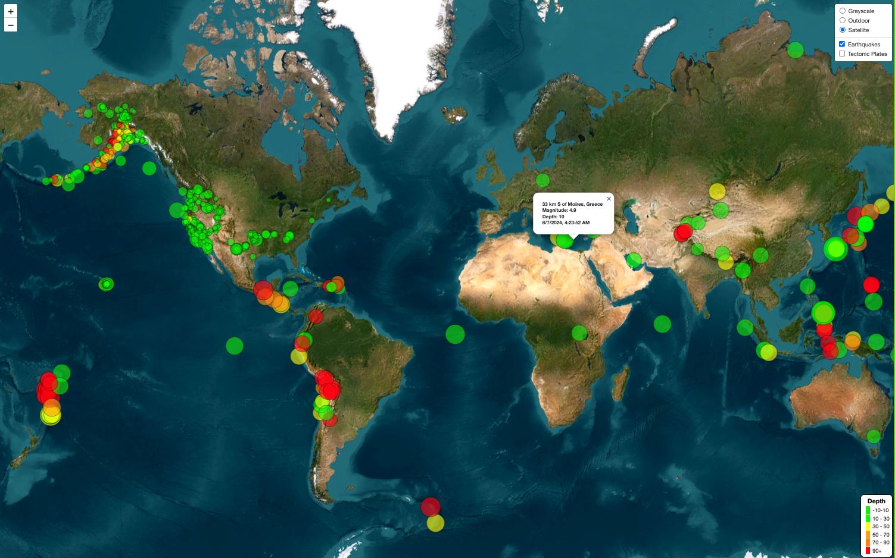

# Global Earthquakes Analysis

## Website: 
[website](https://jennifervasquez1.github.io/leaflet-analysis/)

## Description
Provides a world wide view of recent earthquake activity including details like magnitude, place, time and date.

## Table of Contents
- [Installation](#installation)
- [Usage](#usage)
- [Credits](#credits)
- [License](#license)
- [Features](#features)

- [Contact](#contact)

## Installation
Leaflet, HTML, CSS, JavaScript, D3

## Usage
Analyze the website by clicking on 'Earthquake' to view points on the map, click on 'Tectonic plates' to view on the map

## Credits
Jennifer Harris

## License
MIT

## Features
Map view of detailed information about earthquakes

## Contact
If there are any questions of concerns, I can be reached at:
##### [github: JenniferVasquez1](https://github.com/JenniferVasquez1)
##### [email: jennifer.v.harris@outlook.com](mailto:jennifer.v.harris@outlook.com)
